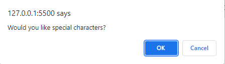

# Password_Generator

## Table of Contents
1. [General Info](#general-info)
2. [Screenshots](#screenshots)
3. [Webpage link](#Webpage-link)
4. [Resources](#resources)

Author: Takara Truong
### General Info
This projects involved using javascript to generate a random password. I built this project to better enhance my Javascript and web API skills. The page will prompt users for a specified length between 8-128, ask for what kind of characters they would like to include, and generate a random password combining the specified characters. If the length is not between the allowed range or if the user does not choose at least one character style, the page will alert the user to choose a allowed length and for at least one character style. User will now be able to generate a random password of their choice based on their preferences on length and character composition.

In this project I, I learned how to concatenate arrays, user Web API's, and define functions. An issue I had early in the beginning was how to deal with the various character styles and how to specifically grab certain characters based on user input. This was solved by created assigning the boolean value created when a user confirms what characters they want to include and assigning it to a value for later use. I also solved the issue of what to do once the user chooses the characters by concatenating the specified character sets a user wants into a empty array which the program can then iterate through to find its random character;

### Screenshots
Password Generated using all 4 character sets with a length of 10 characters.

### Website link
https://truont2.github.io/Password_Generator/

### Resources
* https://developer.mozilla.org/en-US/docs/Web/JavaScript/Reference/Global_Objects/Array/concat
* https://developer.mozilla.org/en-US/docs/Web/JavaScript/Reference/Global_Objects/NaN

